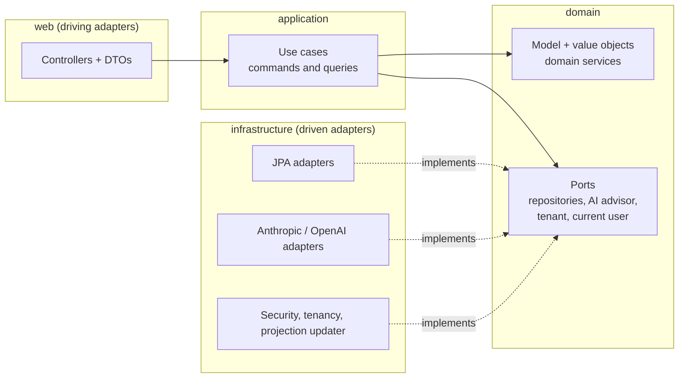

# LedgerAI

A double-entry accounting ledger with an AI financial advisor, built in public as a deep dive into
**Hexagonal Architecture**, CQRS and event-driven projections on a real accounting domain.

> **Status: work in progress, shipped in small episodes.** The backend core works; the frontend folder is
> reserved but has not been started. This README says what is done, what is being worked on, and what is known to be missing.

## Repository layout

A monorepo: the application code is split by deliverable, the infrastructure stays at the root.

```
ledger-ai/
├── backend/            Spring Boot API (Java 21, Maven wrapper, tests)
├── frontend/           Angular app (not started yet)
├── keycloak/           Keycloak realm imported by docker compose (local development)
├── docs/adr/           Architecture decision records
├── docker-compose.yml  Local infrastructure: PostgreSQL + Keycloak
└── .github/workflows/  CI
```

Run the backend commands from `backend/`, and `docker compose` from the repository root. Why it is organised this way:
[ADR 0002](docs/adr/0002-monorepo-layout.md).

## Status

| Area | State | Notes |
|---|---|---|
| Accounts (create, rename, activate/deactivate, search) | ✅ | |
| Journal entries (draft → posted → reversed, balanced-entry invariant) | ✅ | Accounts must exist, be active and match the currency; reversal creates an offsetting entry |
| Balance projection updated by domain events, atomically with the posting | ✅ | Admin rebuild from the journal detects and repairs drift |
| Trial balance report | ✅ | `GET /api/v1/reports/trial-balance` |
| AI advisor (Anthropic or OpenAI behind a port) | ✅ | Works on the trial balance, or on a caller-supplied snapshot |
| Keycloak resource server, role hierarchy | ✅ | `viewer` < `accountant` < `admin` |
| Liquibase migrations, OpenAPI/Swagger | ✅ | |
| Architecture rules enforced by tests (ArchUnit) | ✅ | [ADR 0001](docs/adr/0001-hexagonal-conventions.md) |
| Multi-tenancy | 🚧 | Single tenant by design, **multi-tenant-ready**: every table and repository is tenant-scoped behind a `TenantContext` port |
| AI advisor hardening | 🚧 | Timeouts, structured output, ratios computed in the domain |
| Chart of accounts, general ledger (account statement) | 📅 | |
| Balance sheet, income statement, reports as of a date | 📅 | |
| Accounting periods and closing, audit trail | 📅 | |
| CI pipeline, Dockerfile | 📅 | |
| Angular frontend (Keycloak, Authorization Code + PKCE) | 📅 | |

Legend: ✅ done · 🚧 in progress · 📅 planned

## Architecture

Ports & Adapters, with CQRS-style use cases and a balance projection fed by domain events.



Dependencies point inward only. The rules (and the reasoning behind them, such as "interfaces are outbound
ports only; a use case is a concrete class") are in [ADR 0001](docs/adr/0001-hexagonal-conventions.md) and are
checked on every build by `HexagonalArchitectureTest`.

**How a posted entry reaches the reports**

1. `POST /journal-entries` creates a **draft** (balanced debits and credits are enforced by the aggregate).
2. `POST /journal-entries/{id}/post` posts it and publishes `JournalEntryPostedEvent`.
3. `BalanceProjectionUpdater` updates `balance_projection` after the transaction commits.
4. Reports and the advisor read the projection, never the journal lines.

The projection is updated in the same transaction as the posting (row locks, taken in account order), so an entry
is posted if and only if the projection is updated. The journal stays the source of truth: an admin can rebuild
the projection from it, and the rebuild reports how many accounts had drifted.

## Run it locally

Requirements: Java 21, Docker.

Two separate commands. First the infrastructure (PostgreSQL + Keycloak, realm imported):

```bash
docker compose up -d
```

Then, from `backend/`, the API on http://localhost:8085 with the `local` profile (port 8085 is set in
`backend/src/main/resources/application-local.yml`):

```bash
cd backend
./mvnw spring-boot:run -Dspring-boot.run.profiles=local
```

> **Windows PowerShell:** quote the option, otherwise PowerShell splits it at the first dot and Maven fails with
> `Unknown lifecycle phase ".run.profiles=local"`:
> `./mvnw spring-boot:run "-Dspring-boot.run.profiles=local"`
> (or run it from your IDE with the `local` profile active).

| Service | Port |
|---|---|
| API (profile `local`) | 8085 |
| Keycloak | 8180 |
| PostgreSQL | 5432 |
| Angular frontend (CORS allows it) | 4200 |

- Swagger UI: http://localhost:8085/swagger-ui.html
- Health: http://localhost:8085/actuator/health
- Keycloak admin: http://localhost:8180 (`admin` / `admin`)

**Local users** (realm `ledgerai`, password = username, local development only):

| User | Role | Can |
|---|---|---|
| `viewer` | viewer | read accounts, entries, reports, ask the advisor |
| `accountant` | accountant | + create accounts, record and post entries |
| `admin` | admin | + rename/deactivate accounts, reverse entries |

**Get a token and call the API** (the `ledgerai-dev` client is a local-only shortcut for curl/Postman; the
frontend client uses Authorization Code + PKCE):

```bash
TOKEN=$(curl -s http://localhost:8180/realms/ledgerai/protocol/openid-connect/token \
  -d grant_type=password -d client_id=ledgerai-dev \
  -d username=accountant -d password=accountant | jq -r .access_token)

# create two accounts
CASH=$(curl -s -X POST localhost:8085/api/v1/accounts -H "Authorization: Bearer $TOKEN" \
  -H 'Content-Type: application/json' -d '{"name":"Cash","type":"ASSET","currencyCode":"XAF"}' | jq -r .id)
SALES=$(curl -s -X POST localhost:8085/api/v1/accounts -H "Authorization: Bearer $TOKEN" \
  -H 'Content-Type: application/json' -d '{"name":"Sales","type":"REVENUE","currencyCode":"XAF"}' | jq -r .id)

# record, then post, a balanced entry
ENTRY=$(curl -s -X POST localhost:8085/api/v1/journal-entries -H "Authorization: Bearer $TOKEN" \
  -H 'Content-Type: application/json' -d "{\"description\":\"First sale\",\"currencyCode\":\"XAF\",\"lines\":[
    {\"accountId\":\"$CASH\",\"amount\":100000,\"entryType\":\"DEBIT\"},
    {\"accountId\":\"$SALES\",\"amount\":100000,\"entryType\":\"CREDIT\"}]}" | jq -r .id)
curl -s -X POST localhost:8085/api/v1/journal-entries/$ENTRY/post -H "Authorization: Bearer $TOKEN"

curl -s localhost:8085/api/v1/reports/trial-balance -H "Authorization: Bearer $TOKEN" | jq
```

### Enable the AI advisor

The advisor needs a provider API key (Anthropic is the default provider):

```bash
export LEDGERAI_ADVISOR_ANTHROPIC_APIKEY=...                       # property: ledgerai.advisor.anthropic.api-key
# or: LEDGERAI_ADVISOR_PROVIDER=openai LEDGERAI_ADVISOR_OPENAI_APIKEY=...
curl -s -X POST localhost:8085/api/v1/advisor/analyze-ledger -H "Authorization: Bearer $TOKEN" | jq
```

Without a key the application starts normally; only the advisor calls fail. Note that the ledger's account
names and balances are sent to the chosen provider.

## API overview

| Endpoint | Role |
|---|---|
| `POST /api/v1/accounts` | accountant |
| `PUT /api/v1/accounts/{id}` | admin |
| `GET /api/v1/accounts`, `/{id}`, `/{id}/balance` | viewer |
| `POST /api/v1/journal-entries` | accountant |
| `POST /api/v1/journal-entries/{id}/post` | accountant |
| `POST /api/v1/journal-entries/{id}/reverse` | admin |
| `GET /api/v1/journal-entries`, `/{id}` | viewer |
| `GET /api/v1/reports/trial-balance` | viewer |
| `POST /api/v1/advisor/analyze-ledger`, `/analyze` | viewer |
| `POST /api/v1/admin/projections/balances/rebuild` | admin |
| `GET /api/v1/me` | authenticated |

Authoritative documentation: the OpenAPI spec served by the application.

## Tests

```bash
cd backend
./mvnw test
```

Unit tests per layer (domain, use cases, adapters, mappers, controllers), a framework-free scenario test
(post then reverse nets every account to zero), architecture rules (ArchUnit) and a consistency test for the
shipped Keycloak realm. Persistence tests use H2; Testcontainers/PostgreSQL is planned.

## Troubleshooting

- **`release version 21 not supported`**: Maven runs on an older JDK. Check with `./mvnw -v` (from `backend/`) and point
  `JAVA_HOME` to a JDK 21.
- **`Unknown lifecycle phase ".run.profiles=local"`** (PowerShell): quote the option, see above.
- **401 with `Signed JWT rejected: ... no matching key(s) found`**: the API is not validating tokens against the
  issuer's keys. Check which `JwtDecoder` is active: start the API with `-Ddebug` and read the *Conditions
  Evaluation Report*, and check `./mvnw dependency:tree` (from `backend/`) for an unexpected `oauth2-authorization-server`
  starter. `ResourceServerJwtValidationTest` guards this.
- **After recreating the Keycloak container**: the realm's signing keys are regenerated on every import, so
  restart the API and request a new token.
- **Which token to use**: `ledgerai-dev` (password grant) is for curl/Postman only; the frontend uses
  `ledgerai-frontend` with Authorization Code + PKCE.

## Known limitations

Documented rather than hidden, and the source of the next episodes:

- **First posting on a brand-new account.** The balance projection is updated inside the posting transaction
  with row locks, so postings never lose an update. Two simultaneous *first* postings on an account that has
  no projection row yet can collide on the primary key: one fails cleanly and can be retried.
- **Single currency per ledger in reports.** The trial balance takes its currency from the first account.
- **AI advisor**: no HTTP timeouts or retries, the model computes figures itself, and results are not stored.
- **Tests**: persistence tests (including the concurrency test) run on H2 while production uses PostgreSQL;
  Testcontainers is planned.

## Tech stack

Java 21 · Spring Boot 4 · Spring Security (OAuth2 resource server) · Spring Data JPA · PostgreSQL ·
Liquibase · Keycloak · springdoc-openapi · JUnit 5, Mockito, ArchUnit.

## License

TBD
